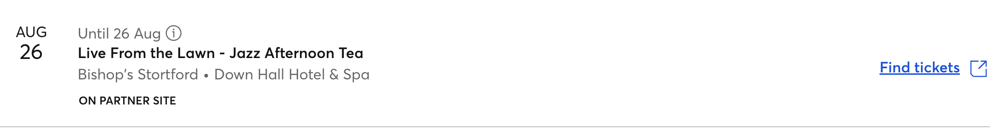

# Prelude ✈️

## Warmup

- Someone share their screen
- Visit the [ticketmaster website](https://www.ticketmaster.co.uk/search?q=jazz&sort=date&startDate=2024-08-26&endDate=2024-08-26&region=605)
- Check you can view an event like this:

- Write down a list of all the **properties** of this event.
E.g. event name, city, etc...
- Create a JS file in this directory and create a [JS object](https://javascript.info/object) with the properties you listed in the previous step

ID
Date
Time
Name
City
Venue
On partner site?