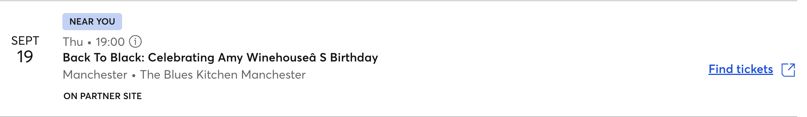

# Sub-goal: Implement an event card component 📇

Preview me! `⇧⌘V` (Mac) or `Ctrl+Shift+V` (Windows)

## Learning objectives ✅

- Implement a functional component
- Describe and explain the meaning of component
- Explain how to use props
- Identify and use the [React documentation](https://react.dev/)

## Acceptance criteria

We can render an event card component as below:

## Key concepts 🔑

- component
- function
- UI - **U**ser **I**nterface
- framework
- arguments vs parameters
- props

## Setup

1. Locate the `app` directory inside the `src` directory
1. Inside `page.js`, declare a function called `MyButton` as in the documentation in the [Creating and nesting component](https://react.dev/learn#components)
1. Nest `MyButton` somewhere inside `Page` and check it is rendered in your browser
1. Create a directory called `components` inside `app`
1. Inside your `components` directory, create a file called `EventCard.jsx`
