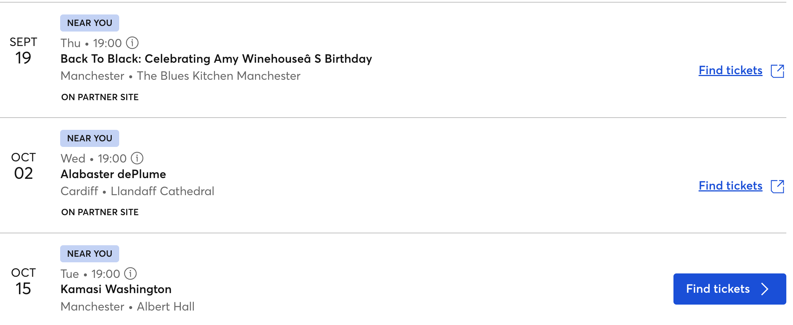

# Sub-goal: Render a static list of event data

Preview me! `⇧⌘V` (Mac) or `Ctrl+Shift+V` (Windows)

## Learning objectives ✅

- Describe and explain a 1-2-1 mapping
- Explain the meaning of static
- Transform a list of data into a list of components

## Key concepts 🔑

- 1-to-1 mapping
- static vs dynamic

## Acceptance criteria

We can render a list of event cards as below:



using a static array of JS objects:

```js
[
  {
    id: '17GOvOG615my7_w',
    name: 'Jazz Sabbath',
    venue: 'Band On The Wall.',
    date: '2025-02-12',
    time: '20:00:00',
    location: 'Manchester',
  },
  {
    id: '17GOvOG6153YNR7',
    name: 'Jazz Sabbath',
    venue: 'Kendal Brewery Arts Centre',
    date: '2025-02-13',
    time: '20:00:00',
    location: 'Cumbria',
  },
];
```

## Setup

- Create a new file called `List.jsx` inside `components`
- Declare a new function component called `List` inside `List.jsx`
- Export the `List` component and import it into `page.js` at the top of `app`
- Inside your `List` component, follow this section of the documentation to render a list of people https://react.dev/learn/rendering-lists
